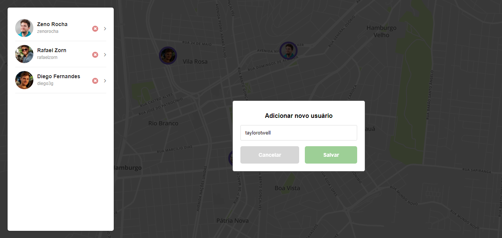
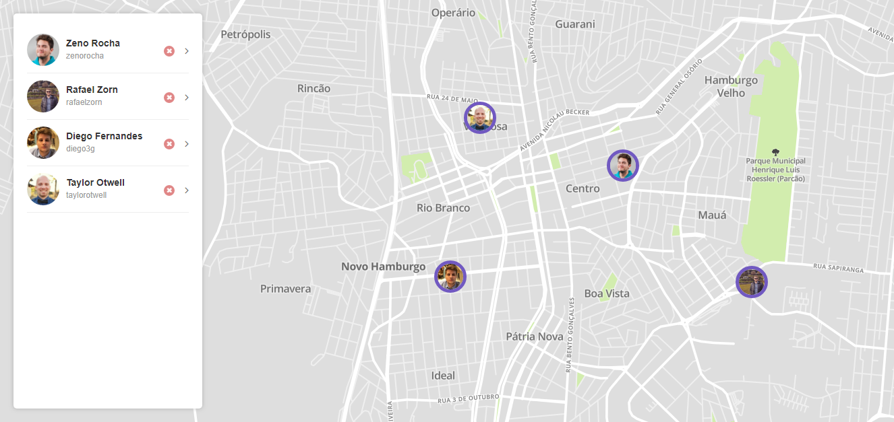

  <h3 align="center">3rd Rocketseat GoReact Challenge</h3>

---

## Overview

3rd challenge of the Rocketseat GoReact course.

## Preview

### APIs

- [Github API](https://api.github.com)

## Running the project

- Clone this repository
- Install all dependencies using the command `yarn`
- Fill the `.env` file
- Access http://localhost:3000/

## Used technologies

- React
- React-Map-GL
- Redux Saga
- Styled Component
- Other React JS libs